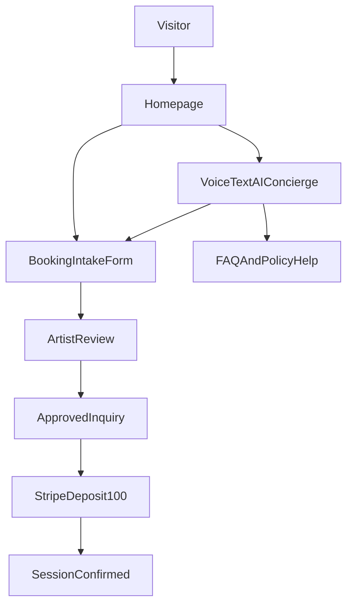

# Ozzy Fox Website Build Guide

## Project Goal

Build a premium cyber-luxe tattoo website for Ozzy Fox in black, pink, and white that:
- Converts visitors into qualified booking inquiries.
- Secures a fixed `$100` deposit for approved projects.
- Showcases portfolio work with high visual impact.
- Integrates social channels for audience growth.
- Includes an xAI-powered voice+text chatbot.
- Showcases Nexteleven capability for future artist clients.

## Master Scope Statement

This file is the single source of truth for build, QA, deployment, and handoff.  
If implementation details are missing in code comments or tickets, default to this guide.

## Brand + Experience Direction

- **Visual style:** Cyber-luxe (dark premium aesthetic, subtle glow, cinematic movement).
- **Primary colors:** black base, electric pink accents, white text.
- **Typography style:** editorial display heading + clean body font.
- **Motion language:** soft parallax, reveal animations, glowing hover states, magnetic CTAs.
- **Tone:** confident, artistic, premium, direct.

## Required Attribution (Non-Negotiable)

- **Site footer:** clickable text `Made by Nexteleven` linking to `https://nextelevenstudios.online`.
- **Chatbot footer:** clickable text `Powered by Nexteleven` linking to `https://nextelevenstudios.online`.
- Open both links in a new tab and include accessible labels.
- Keep attribution visible on desktop and mobile.

## Recommended Stack (April 2026)

- **Framework:** Next.js 16 (App Router) + TypeScript.
- **Styling/UI:** Tailwind CSS + component primitives.
- **Animation:** Motion library for transitions and micro-interactions.
- **Hosting:** Vercel.
- **Payments:** Stripe Checkout for deposits.
- **AI:** xAI integration via secure server route.
- **Forms/validation:** React Hook Form + Zod.
- **Storage/CMS (optional phase):** Sanity or file-backed content for portfolio management.

## Dependency Baseline (Install Set)

- `next`, `react`, `react-dom`, `typescript`
- `tailwindcss`, `postcss`, `autoprefixer`
- `zod`, `react-hook-form`, `@hookform/resolvers`
- `stripe`
- `framer-motion`
- `@vercel/analytics` (or equivalent analytics SDK)
- `lucide-react`
- `clsx`, `tailwind-merge`
- `date-fns`

## Implementation Defaults (Locked)

- Build with `Next.js 16` using App Router and Server Components by default.
- Keep booking/deposit logic server-side only (no secret keys client-side).
- Use fixed `$100` Stripe deposit for MVP; no tiering in phase 1.
- Launch with text chatbot first, then enable voice mode once browser/device QA passes.
- Prioritize Facebook + Instagram links as canonical public social profiles.
- Keep Ozzy brand as primary visual focus and Nexteleven branding as secondary proof layer.

## Environment Variables (Required)

- `NEXT_PUBLIC_SITE_URL` (production canonical URL)
- `XAI_API_KEY` (server-only)
- `XAI_MODEL` (assistant model identifier)
- `STRIPE_SECRET_KEY` (server-only)
- `STRIPE_WEBHOOK_SECRET` (server-only)
- `NEXT_PUBLIC_STRIPE_PUBLISHABLE_KEY`
- `STRIPE_DEPOSIT_PRICE_ID` (or fixed amount config)
- `BOOKING_RECIPIENT_EMAIL` (or notification endpoint)
- `NEXT_PUBLIC_GA_MEASUREMENT_ID` (if GA is enabled)

## API Surface (MVP Contracts)

### `POST /api/booking`

- Accepts booking payload (concept, style, placement, size, budget, timeline, availability, consent flags).
- Validates schema server-side and rejects incomplete/invalid submissions.
- Returns booking reference id for follow-up and analytics correlation.
- Success response: `{ ok: true, bookingId: "bk_xxx", status: "submitted" }`
- Error response: `{ ok: false, code: "VALIDATION_ERROR", message: "...", fields: {} }`

### `POST /api/deposit`

- Accepts approved booking reference id.
- Creates Stripe Checkout Session for fixed `$100` deposit.
- Returns checkout URL and logs session metadata for reconciliation.
- Success response: `{ ok: true, checkoutUrl: "https://checkout.stripe.com/...", sessionId: "cs_xxx" }`

### `POST /api/ai/voice-chat`

- Accepts message history and optional voice transcript.
- Applies guardrail system prompt and policy constraints.
- Returns concise response + optional booking-handoff action hint.
- Success response: `{ ok: true, reply: "...", action: "offer_booking_handoff" }`

### `POST /api/stripe/webhook`

- Verifies Stripe webhook signature.
- On successful payment, updates booking state to `deposit_paid`.
- Triggers confirmation message flow (email/SMS if configured).

## Data Schemas (Canonical)

### Booking Request Payload

- `fullName: string`
- `email: string`
- `phone?: string`
- `concept: string`
- `placement: string`
- `estimatedSize: string`
- `styleDirection: string`
- `budgetRange: string`
- `timeline: string`
- `availability: string`
- `notes?: string`
- `referenceUrls?: string[]`
- `consentDeposit: boolean`
- `consentAge18: boolean`
- `consentPolicy: boolean`

### Booking Status Enum

- `submitted`
- `under_review`
- `approved`
- `declined`
- `deposit_pending`
- `deposit_paid`
- `scheduled`

## Site Architecture

- `/` Home
- `/portfolio`
- `/book`
- `/about`
- `/faq` (optional but recommended)
- `/policies` (deposit + cancellation + prep/aftercare summary)

## Canonical File Map (Target Structure)

- `app/layout.tsx`
- `app/page.tsx`
- `app/portfolio/page.tsx`
- `app/book/page.tsx`
- `app/about/page.tsx`
- `app/faq/page.tsx`
- `app/policies/page.tsx`
- `app/api/booking/route.ts`
- `app/api/deposit/route.ts`
- `app/api/ai/voice-chat/route.ts`
- `app/api/stripe/webhook/route.ts`
- `components/layout/Navbar.tsx`
- `components/layout/Footer.tsx`
- `components/branding/NextelevenSignature.tsx`
- `components/hero/HeroReel.tsx`
- `components/portfolio/PortfolioGrid.tsx`
- `components/booking/BookingIntakeForm.tsx`
- `components/booking/DepositCheckoutCard.tsx`
- `components/ai/VoiceConcierge.tsx`
- `components/social/SocialWall.tsx`
- `components/showcase/NextelevenCaseStudyStrip.tsx`
- `components/showcase/ArtistLeadCTA.tsx`
- `lib/validation/booking.ts`
- `lib/stripe.ts`
- `lib/xai.ts`
- `lib/analytics.ts`
- `lib/constants.ts`
- `types/booking.ts`
- `types/chat.ts`
- `styles/globals.css`
- `.env.example`

### Key Components

- `HeroReel` (cinematic portfolio-first hero)
- `StickyBookCTA`
- `PortfolioGrid` with filters and lightbox
- `BookingIntakeForm` (multi-step)
- `DepositCheckoutCard`
- `VoiceConcierge` (xAI voice+text assistant)
- `SocialWall`
- `TestimonialsStrip`
- `NextelevenCaseStudyStrip`
- `ArtistLeadCTA`
- `NextelevenSignature` (footer/chat attribution helper)

## Conversion-First Homepage Structure

1. Portfolio hero (best work first).
2. Immediate `Book + Deposit` CTA.
3. Trust layer (testimonials, standards, process).
4. Portfolio highlights.
5. Booking flow explainer.
6. AI assistant prompt block.
7. Social proof and links.
8. Nexteleven case-study strip + artist lead CTA.
9. Footer with required attribution.

## Booking + Deposit Flow

1. Visitor submits detailed tattoo inquiry.
2. Ozzy reviews inquiry and approves/declines fit.
3. Approved inquiry receives secure Stripe deposit link.
4. Client pays fixed `$100` deposit.
5. Session confirmation + prep instructions sent.

## Booking Form Microcopy (Ready to Implement)

- **Title:** `Start Your Tattoo Project`
- **Intro:** `Tell Ozzy about your idea and we’ll review your request within 1–2 business days. Approved projects receive a secure deposit link to lock the session.`
- **Submit button:** `Submit Tattoo Request`
- **Success:** `Request received. Ozzy will review your submission and contact you with next steps.`

### Form Fields

- `Tattoo concept` (idea details)
- `Placement on body`
- `Estimated size`
- `Style direction`
- `Reference images`
- `Budget range`
- `Preferred timeline`
- `Availability`
- `Anything we should know?`

### Required Consent Checkboxes

- `I understand a $100 non-refundable deposit is required to confirm an approved booking.`
- `I confirm I am 18+ with valid ID at appointment time.`
- `I have read and accept the cancellation/reschedule policy.`

## Deposit Policy Copy (Ready to Implement)

- `A $100 non-refundable deposit is required to secure all approved tattoo appointments. This deposit is applied toward the final session total.`
- `Need to reschedule? Please give at least 48 hours’ notice to transfer your deposit to a new date.`
- `Cancellations or reschedule requests made with less than 48 hours’ notice may forfeit the deposit.`
- `No-shows forfeit the deposit and require a new deposit to rebook.`
- `Deposits reserve artist time, drawing/prep time, and your calendar slot.`
- **Checkout CTA:** `Pay $100 Deposit`

## xAI Chatbot Scope + Copy

### Capabilities

- Answer FAQs (policies, prep, aftercare basics, timeline expectations).
- Help users shape tattoo direction.
- Guide users into booking form.
- Capture intent and pre-fill booking context.

### Guardrails

- No medical advice.
- Escalate sensitive/complex questions to human follow-up.
- Keep responses concise and artist-aligned.
- Never promise availability before manual artist approval.
- Never quote exact prices without context; use ranges and booking handoff.

### System Prompt Rules (Contract)

- Tone: confident, friendly, concise, studio-appropriate.
- Response length target: 2-5 sentences unless user asks for detail.
- Offer booking handoff when intent is high.
- Never fabricate appointment availability.
- Never provide exact pricing commitments before review.
- Decline medical advice and route to professional care.

### Voice UX Contract

- Push-to-talk input + transcript preview before send.
- Text input remains available at all times.
- If microphone permission is denied, fallback to text instantly.
- If transcription fails, preserve user draft and offer retry.

### Welcome Script

- `Yo — I’m Fox Concierge for Ozzy. I can help with ideas, placement, prep, pricing ranges, booking steps, and deposits. Want to start your tattoo request now?`

### Suggested Quick Replies

- `Start Booking`
- `Deposit Questions`
- `Tattoo Prep`
- `Aftercare Basics`
- `Talk to Human`

### Footer Attribution

- `Powered by Nexteleven` -> `https://nextelevenstudios.online`

## Nexteleven Showcase Layer (Lead Generation)

Purpose: make this free build generate future paid artist clients.

### Required Showcase Blocks

- **Case-study strip:** `Built by Nexteleven` with performance + conversion proof.
- **3-step process story:** Brand Direction -> Conversion Architecture -> AI Enablement.
- **Artist lead CTA:** `Tattoo artist? Want a site that books while you tattoo?`
- **Lead form/button:** `Get My Artist Site`

### Suggested Supporting Copy

- `We build high-conversion artist websites with cinematic design, AI concierge, and deposit-ready booking flows.`
- Alternate luxury line: `Your art is elite. Your website should be too.`

### Balance Rule

- Ozzy brand remains primary.
- Nexteleven showcase appears as secondary trust/proof layer.

## Content + Asset Checklist (Pre-Build)

- 15-25 curated portfolio media assets (web-optimized + originals archived).
- Hero reel media cut (short loop for landing impact).
- Ozzy bio copy (short + long versions).
- Studio trust assets (licenses/certifications/hygiene standards where applicable).
- Policy copy reviewed for local legal/business requirements.
- FAQ source list (top 12 recurring client questions).
- Social profile metadata and brand-safe avatars/banners.

## Event Tracking Plan (Minimum Analytics Schema)

- `hero_cta_click`
- `booking_form_started`
- `booking_form_submitted`
- `booking_form_validation_error`
- `deposit_checkout_opened`
- `deposit_paid_success`
- `chatbot_opened`
- `chatbot_message_sent`
- `chatbot_booking_handoff_clicked`
- `social_click_facebook`
- `social_click_instagram`
- `nexteleven_artist_cta_click`
- `nexteleven_lead_submitted`

## Error States + UX Behavior

- Booking API failure: preserve form inputs and show inline retry.
- Deposit session error: show fallback contact CTA and log error id.
- Chat timeout: non-blocking retry with short status message.
- Social embed failure: fallback to direct social buttons.
- Unknown error: generic recovery message + support path.

## Security Controls

- Rate limit `POST /api/booking` and `POST /api/ai/voice-chat`.
- Add anti-spam protection to booking form (honeypot or challenge).
- Sanitize user text fields before persistence.
- Never log secret keys or full PII payloads.
- Verify Stripe webhook signature before status updates.

## Accessibility Standards

- WCAG 2.2 AA target across key pages.
- Keyboard-first navigation for forms, menus, and chatbot.
- Visible focus states for all interactive elements.
- Reduced-motion mode must disable heavy effects.
- Maintain pink-on-black contrast at readable levels.

## Testing Matrix (Required Before Launch)

### Functional

- Inquiry submission success and validation failure states.
- Deposit checkout creation and webhook confirmation flow.
- Chatbot FAQ + booking handoff behavior.
- Attribution links present and clickable across site and chatbot.
- Facebook/Instagram links route to canonical URLs.

### Browser + Device

- Desktop: Chrome, Safari, Firefox.
- Mobile: iOS Safari, Android Chrome.
- Voice mode tested for mic allow/deny/failure paths.

### Non-Functional

- Lighthouse and CWV thresholds met.
- API latency acceptable under light concurrent use.
- No blocking console/runtime errors on key routes.

## Compliance + Policy Requirements

- Age gate statement for 18+ requirement before booking submit.
- Clear deposit and cancellation policy acknowledgement in form.
- Privacy notice covering form data usage and retention.
- Cookie/analytics disclosure if tracking is enabled.
- Accessibility checks for contrast, focus states, keyboard traversal, and reduced motion.

## Social + Audience Growth

- **Canonical social profiles (use exact URLs):**
  - Facebook: `https://www.facebook.com/ozzy.fox.532006`
  - Instagram: `https://www.instagram.com/ozzinks`
- Feature Facebook and Instagram first in nav/footer/social wall before adding other networks.
- Embed or feature latest Instagram/TikTok/X content.
- Add clear follow CTAs near portfolio sections.
- Track outbound clicks by platform.
- Reuse fresh tattoo drops as homepage highlights.

## SEO + Discoverability

- Target keywords: `tattoo artist [city]`, `custom tattoo [city]`, `blackwork tattoo [city]`.
- Unique metadata per route.
- Schema markup for LocalBusiness + Person + FAQ.
- Fast media delivery and descriptive alt text for portfolio items.

## Performance + Quality Targets

- Lighthouse: Performance `>=95`, Accessibility `>=95` on key pages.
- Core Web Vitals: LCP `<2.5s`, INP `<200ms`, CLS `<0.1`.
- Keyboard navigable UI and reduced-motion support.
- Rate-limit AI and booking APIs.
- Validate Stripe/webhook signatures.

## Analytics + KPI Tracking

- Booking inquiry submissions.
- Inquiry -> deposit conversion rate.
- Chatbot usage + chatbot-assisted inquiry rate.
- Social outbound click-through rate.
- `Want this for your studio?` lead submissions.

## Delivery Phases

### Phase 1 (MVP)

- Home, Portfolio, Book routes.
- Booking form + backend intake.
- Stripe `$100` deposit flow.
- Basic social links/wall.
- Text chatbot.
- Required attribution links.
- Event tracking baseline.

### Phase 2 (Enhancement)

- Full voice assistant.
- Richer social module.
- Testimonial system.
- Funnel analytics dashboard.
- Automated confirmation messaging and richer CRM handoff.

### Phase 3 (Scale)

- Personalization by tattoo style interest.
- Smarter AI pre-qualification.
- Retargeting hooks.
- Nexteleven showcase optimization.

## Final Launch Checklist

- Portfolio includes 15-25 strongest pieces.
- Policies are legally reviewed for local requirements.
- Mobile QA complete for booking + chatbot + attribution visibility.
- Deposit flow tested end-to-end in Stripe test and live modes.
- Facebook and Instagram links verified in nav, footer, social wall, and contact/booking surfaces.
- Attribution links verified:
  - `Made by Nexteleven`
  - `Powered by Nexteleven`
- First-week analytics review scheduled for optimization.
- Privacy/policy pages published and linked from footer.
- Voice chatbot tested on mobile Safari + Chrome (mic permissions + fallback text mode).

## CI/CD + Deployment Runbook

1. Create Vercel project and connect repository.
2. Add all required environment variables to Preview + Production.
3. Configure Stripe webhook endpoint for production domain.
4. Validate preview build and core conversion flow.
5. Promote to production.
6. Run post-launch smoke tests for booking, deposit, chatbot, and social links.

## Post-Launch Operations

- Review analytics at 24h, 72h, and day 7.
- Investigate failed booking/deposit events and patch friction points.
- Update chatbot FAQ responses from real user queries.
- Publish initial Nexteleven case-study snapshot with metrics.
- Monitor and respond to artist leads from showcase CTA.

## 10-Day Execution Sprint (Recommended)

### Days 1-2: Foundation

- Initialize Next.js app scaffolding, design tokens, global layout, navigation, and footer attribution.
- Set env var scaffolding and secure server route conventions.

### Days 3-4: Core Conversion UI

- Build home sections, portfolio grid, and booking form UI with validation.
- Add social module with canonical Facebook/Instagram links.

### Days 5-6: Backend + Payments

- Implement booking API and deposit API.
- Integrate Stripe Checkout + webhook reconciliation.

### Days 7-8: AI Concierge

- Ship text chatbot with guardrails and booking handoff.
- Add voice mode with transcript fallback.

### Day 9: Showcase + Analytics

- Add Nexteleven case-study strip and artist lead CTA.
- Instrument event tracking and verify data flow.

### Day 10: QA + Launch

- Run accessibility/performance/security checks.
- Final content pass, policy pass, and production deployment.

## Definition of Done (Launch Gate)

- Users can discover portfolio, submit inquiry, and complete deposit flow without blockers.
- Ozzy can review inquiries and identify deposit-paid clients reliably.
- Chatbot answers key FAQs and routes booking intent correctly.
- Canonical social links and required Nexteleven attributions are visible and functional.
- Performance, accessibility, and policy requirements pass launch thresholds.

## Handoff Checklist (Client + Portfolio)

- Deliver editable copy and policy source docs.
- Deliver env var checklist and integration ownership notes.
- Deliver event map and analytics definitions.
- Deliver media optimization guidelines for future uploads.
- Deliver case-study package outline for Nexteleven sales reuse.
